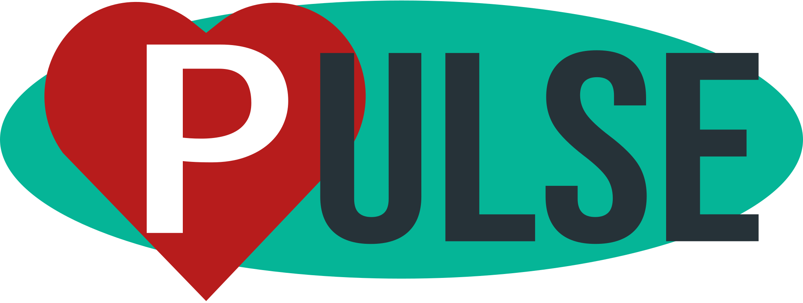

---


An app I wrote to flex my frontend development skills and solve a problem I have:

```text
How do I organize the millions of photos I have spread across a thousand different storage mediums?
```

The initial concept for this app came when I most recently upgraded my computer. I now have a number of old machines with a hodgepodge of images, videos, documents, etc. I wanted to design a way for me to organize, tag, compare, and link these images with external services like Google Photos, Dropbox, etc.

## Features

-   Persistent State
-   Embedded Database
-   Theming

### Tech Demos

Examples of the following features exist in the app, but are planned to undergo major redevelopment.

-   Language Support
-   Multi-process IPC
-   Compiled Plugins

Built with Electron, React, Redux, PouchDB, and a million other minor tools

## UI Examples


---


---


## Development

I haven't added full cross-platform development support, so assuming you're running a linux machine and have vscode set up, or want to troubleshoot npm scripts, all you have to do to start working is the following:

### Clone into the repo and run:

```shell
npm install
```

### Run (vscode):

Open the project and press the `F5` key to run the `Start Webpack Dev` task


### Run (shell):

```shell
npm run start
```

Hot reloading is enabled, so you can keep the app running as you develop.

## License

Copyright (C) 2020 Quinn Mikelson

Licensed under the [GNU GPLv3](https://spdx.org/licenses/GPL-3.0-or-later.html) license. A copy of this license is included; see [COPYING](./COPYING)

This program is free software: you can redistribute it and/or modify it under the terms of the GNU General Public License as published by the Free Software Foundation, either version 3 of the License, or (at your option) any later version.

This program is distributed in the hope that it will be useful, but WITHOUT ANY WARRANTY; without even the implied warranty of MERCHANTABILITY or FITNESS FOR A PARTICULAR PURPOSE. See the GNU General Public License for more details.
