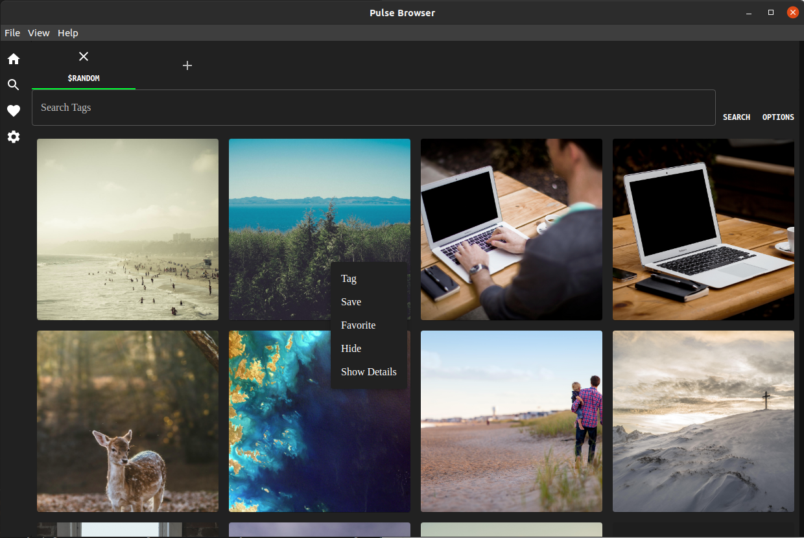
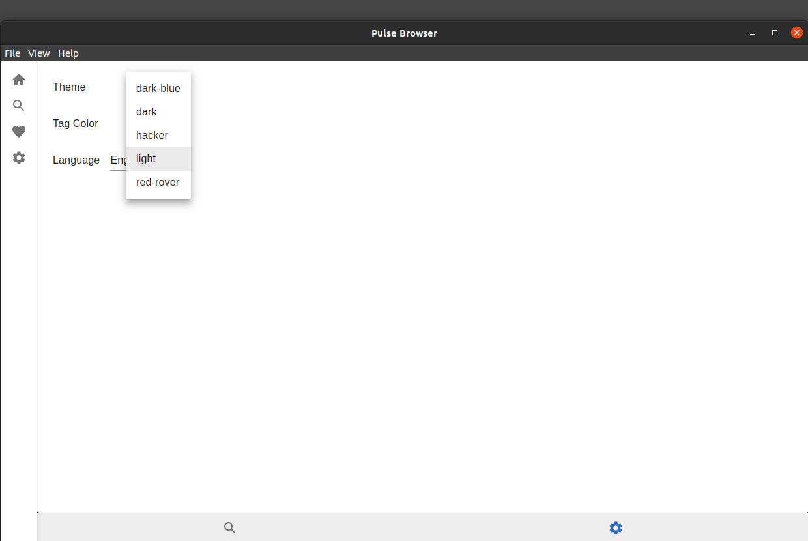
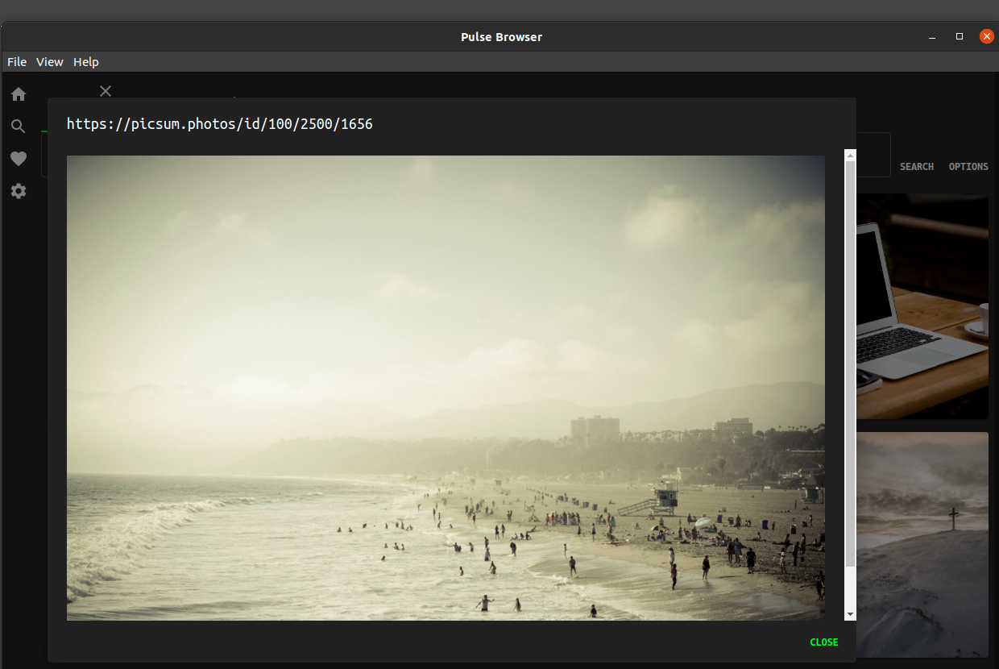
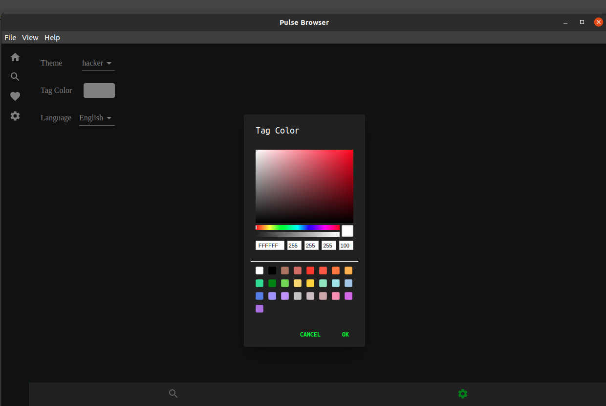

# Pulse Browser



An app I wrote to flex my frontend development skills and solve a problem I have:

```text
How do I organize the millions of photos I have spread across a thousand different storage mediums?
```

The initial concept for this app came when I most recently upgraded my computer. I now have a number of old machines with a hodgepodge of images, videos, documents, etc. I wanted to design a way for me to organize, tag, compare, and link these images with external services like Google Photos, Dropbox, etc.

## Features

-   Persistent State
-   Embedded Database
-   Theming

### Tech Demos

Examples of the following features exist in the app, but are planned to undergo major redevelopment.

-   Language Support
-   Multi-process IPC
-   Compiled Plugins

Built with Electron, React, Redux, PouchDB, and a million other minor tools

# UI



---



---

